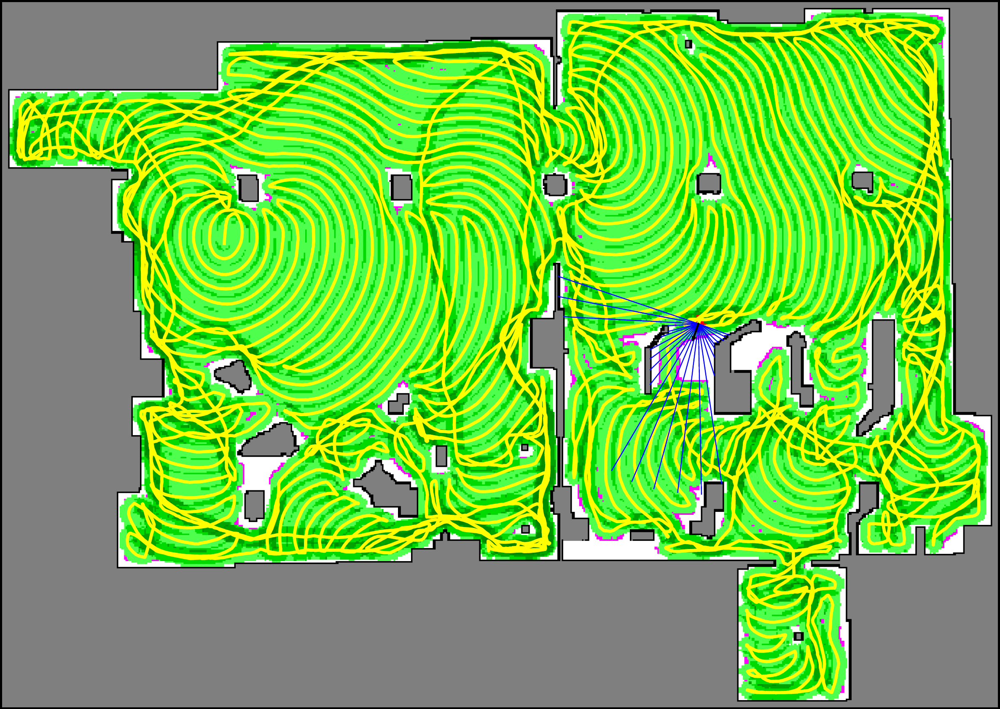
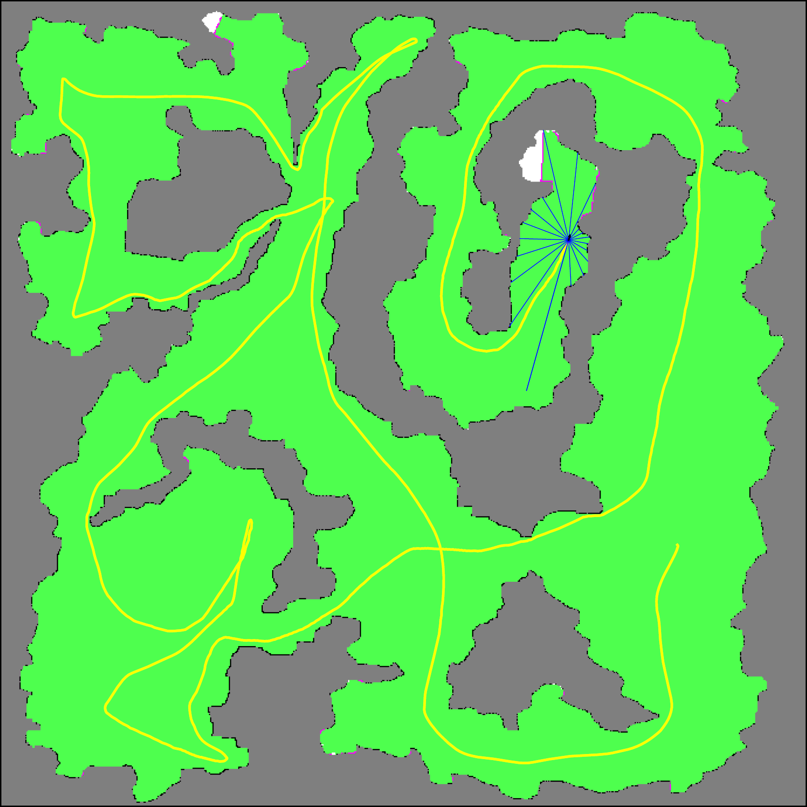
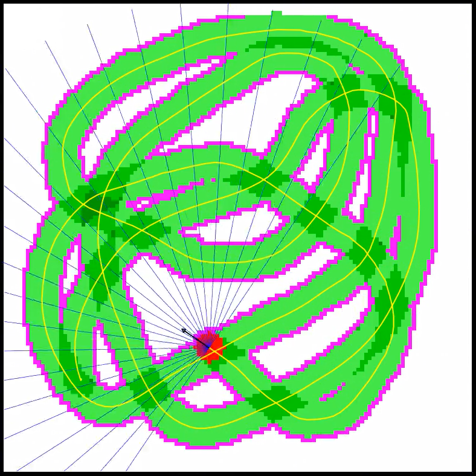
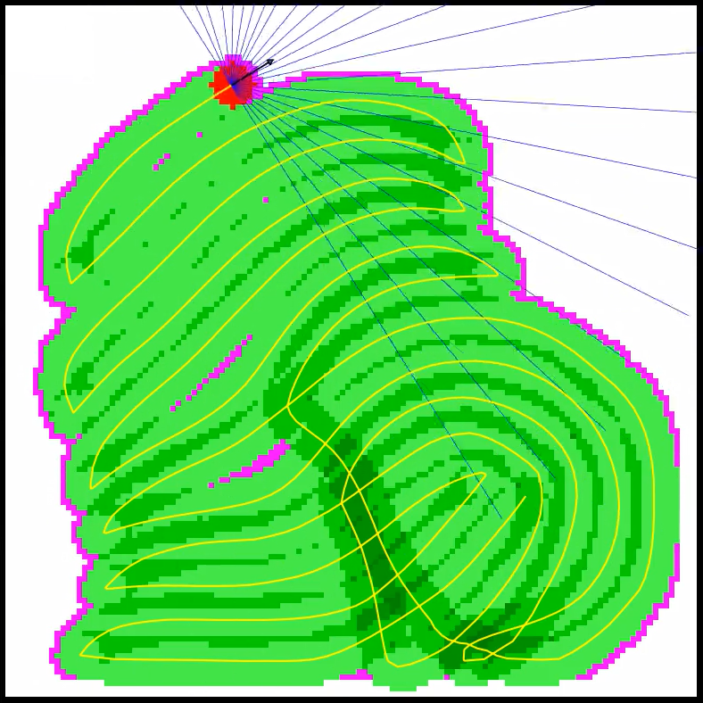

# RL Coverage Path Planning

Code implementation for the paper [__Learning Coverage Paths in Unknown Environments with Deep Reinforcement Learning, arXiv, 2023__](https://arxiv.org/pdf/2306.16978.pdf).

Lawn mowing | Exploration
:-------------------------:|:-------------------------:
 | 

WITHOUT total variation reward | WITH total variation reward
:-------------------------:|:-------------------------:
 | 

## Install

* [Install miniconda](https://docs.conda.io/en/latest/miniconda.html)
* `conda create -n rlm python=3.9`
* `conda activate rlm`
* (CPU) `pip install torch==1.13.1+cpu torchvision==0.14.1+cpu -r requirements.txt --extra-index-url https://download.pytorch.org/whl/cpu`
* (GPU) `pip install torch==1.13.1+cu116 torchvision==0.14.1+cu116 -r requirements.txt --extra-index-url https://download.pytorch.org/whl/cu116`

## Run

Train an RL agent for CPP in a simulated 2D environment (reduce `--buffer_size` if memory is limited):
* Mowing: `python train.py --logdir my-experiment`
* Exploration: `python train.py --logdir my-experiment --exploration --local_tv_reward_scale 0.2 --no-overlap_observation --no-steering_limits_lin_vel`

Check how the trained agent performs:
* Plot logs: `python plot.py --load my-experiment`
* Render: `python eval.py --load my-experiment`

## Tests

Run tests:
* Run `pytest` from the root folder.
